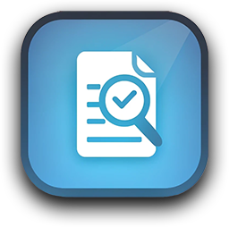

	
	<h1>File Name Checker</h1>
	

		<b>Ensures your files meet length and character requirements.</b>
	

	 
	 

## Overview

**File Name Checker** is an open-source, lightweight, and fast C# WinForms application designed to recursively scan folders and identify files that do not meet specific file name criteria. This tool is particularly beneficial for users of Synology NAS devices who encounter cryptic errors when attempting to perform encrypted backups on external devices due to file name length restrictions.

## Features

- **Recursive Scanning:** Thoroughly scans all files within a specified folder and its subfolders.
- **Customizable Checks:** Allows users to define maximum allowable file name lengths and specify disallowed characters.
- **Synology NAS Support:** Specifically helps Synology NAS users avoid frustrating errors that arise during encrypted backups on external devices, where file names longer than 143 characters are not supported.
- **Lightweight and Fast:** Optimized for performance, ensuring quick scans even on large directories. One of the tests was done on 600.000 files of a total of 430GB on an AMD Ryzen 9 5950X and this took ~3 minutes.

## Use Cases

- **Synology NAS Encrypted Backups:** Prevent and troubleshoot errors related to file name length when backing up data on external devices with encryption enabled on a Synology NAS.
- **File Name Validation:** Ensure files across your directories adhere to organizational or software-specific naming conventions.
- **Data Preparation:** Clean up file names before transferring data to systems with strict file name requirements.

## Getting Started

### Prerequisites

- Windows OS
- .NET Framework 6.0

### Download
Archive: [File Name Checker v.1.0](https://github.com/JeFawk/FileNameChecker-App-Code/releases/download/v1.0/File.Name.Checker.v.1.0.zip)

Or:
1. Clone or download the repository
2. Navigate to the `Download\File Name Checker\` folder
3. Run `File Name Checker.exe`

### Usage

1. **Select a path:** Choose the path with folders or files which you want to scan.
2. **Set the file name criteria:**
    - Define the maximum file name length, by default it's set to 143 which helps with Synology NAS encrypted backups on external devices (an external HDD).
    - Specify any disallowed characters, by default the list present there contains characters not allowed if a Synology NAS encrypted backup takes place.
3. **Start the scan:** Click the "Start" button to begin the process.
4. **Review results:** The application will list all files that do not meet the specified criteria.

## Screenshots

## Build the application

For debugging purposes or if you wish to modify it, the `.sln` file can be opened in Visual Studio. To build it press `F5` or select `Build Solution` from the `Build` menu.

## Contributing

Contributions are welcome! If you find a bug or have a feature request, please open an issue or contact me on Discord. Feel free to fork the repository and submit a pull request with your improvements.

Please make sure to follow the [contribution guidelines](CONTRIBUTING.md).

## License

This project is licensed under the MIT License - see the [LICENSE](LICENSE) file for details.

## Acknowledgments

- Thanks to the open-source community and Stack Overflowers.
- Inspired by the annoyances faced by Synology NAS users during encrypted backups.

